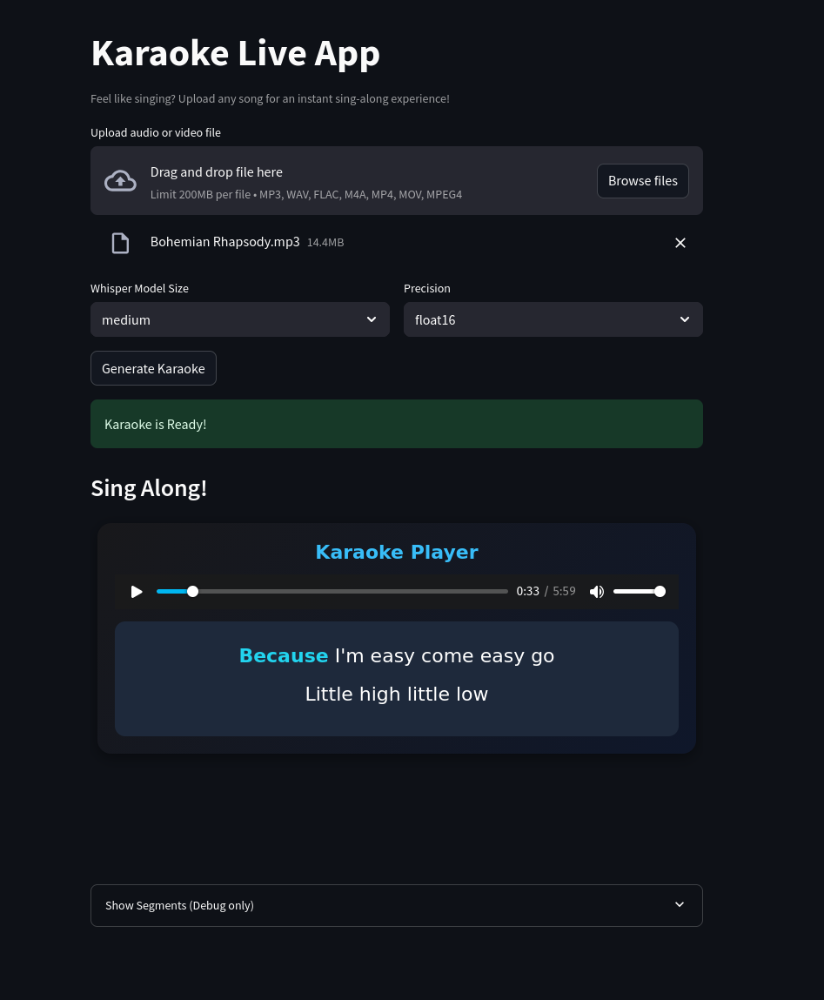

# Karaoke Live App

Karaoke Live App lets you turn any audio or video file into an instant sing-along experience.

You can upload a song, and the app automatically separate the vocals, builds an instrumental track, and generates syncrhonized on-screen lyrics so you can sing along in real time - just like a karaoke machine.



## How It Works
1. Launch the app in your browser (Streamlit opens a local webpage)
2. Drag or drop or browse to select your audio or video file
3. Choose the Model Size and Precision and press **Generate Karaoke**.
4. Take a sip and prepare for your vocal session!

## Installation

1. Clone the app 
```bash
    git clone https://github.com/tinngo777/Karaoke-Live-App.git
```

2. Install requirements 
```bash
    cd Karaoke-Live-App
    pip install -r requirements.txt
```

3. Run
```bash
    streamlit run app.py
```
## Tech Stack / Credits
- Python 3.10.12
- Streamlit - UI
- OpenAI Whisper(via faster-whisper) - lyrics transcription
- Demucs - source separation
- PyTorch - GPU acceleration
- ffmpeg - media processing
- librosa/soundfile/numpy - audio handling

## Tested Environment
This app was tested on Pop OS 22.04 with the following specs:
- Kernel: 6.12.10
- CPU: 11th Gen Intel Core I7
- GPU: NVIDIA GeForce RTX 3050Ti (4GB VRAM)
- RAM: 16GB


## Future Improvement
- Occasionally, the lyric extraction may stop before the song's outro or miss a few lines - usually happens after a long instrumental (non-vocal) period. -> I'm working to fix that in the next commit

- Other than that, my plan for next commit is to make the highlight in karaoke smoother, and perhaps if I have time I can redo the UI/UX. 